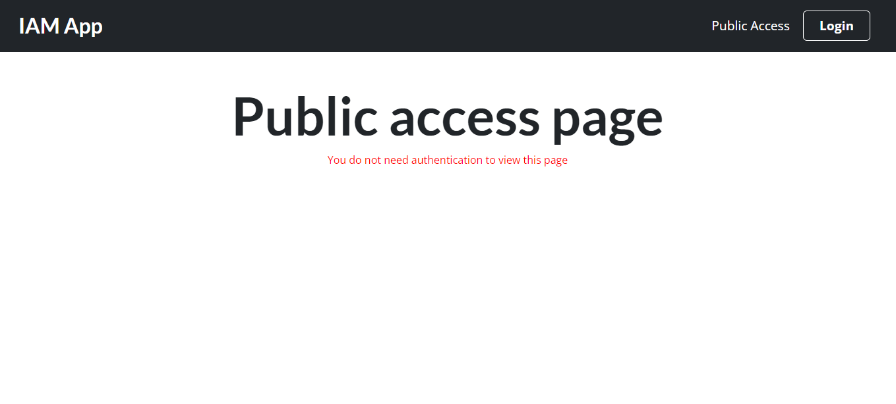
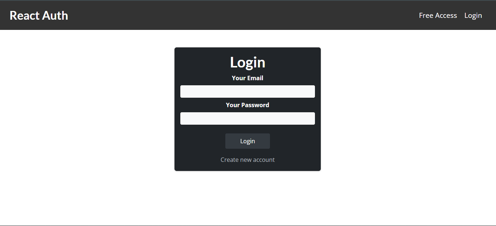
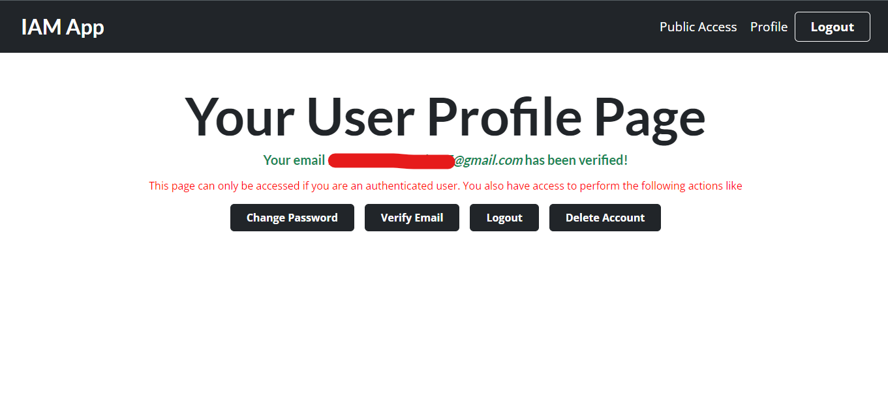
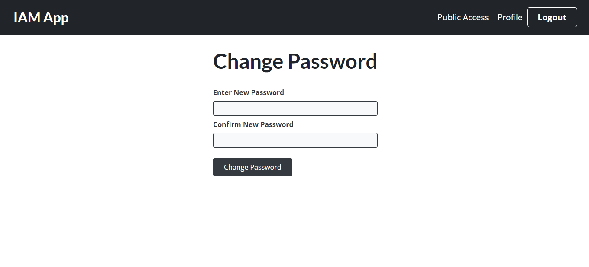

# Auth-App

A simple authentication app.

## Preview

## Tools

- [Firebase Auth REST API](https://firebase.google.com/docs/reference/rest/auth)

## Resources

- [localstorage vs Cookies](https://academind.com/tutorials/localstorage-vs-cookies-xss)

## Dependences

- [React](https://reactjs.org/docs/getting-started.html)
- [React Router](https://reactrouter.com/docs/en/v6/getting-started/installation)

## Setting Up Locally

- Clone the repository to your machine
- Open up a terminal
- Navigate into the project directory
- Run <code>npm install</code> to install all needed dependencies
- Run <code>npm start</code> to spin up the server
- The server runs on port 3000 <code>http://localhost:3000/</code>
- Open [http://localhost:3000](http://localhost:3000) to view it in the browser.

## Learn More

You can learn more in the [Create React App documentation](https://facebook.github.io/create-react-app/docs/getting-started).

To learn React, check out the [React documentation](https://reactjs.org/).
